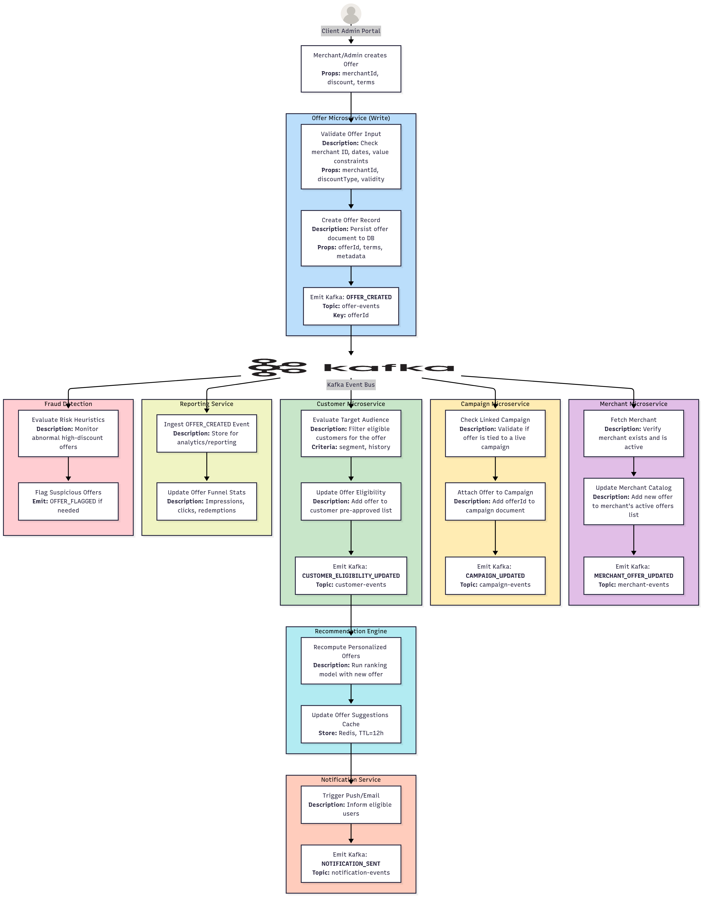
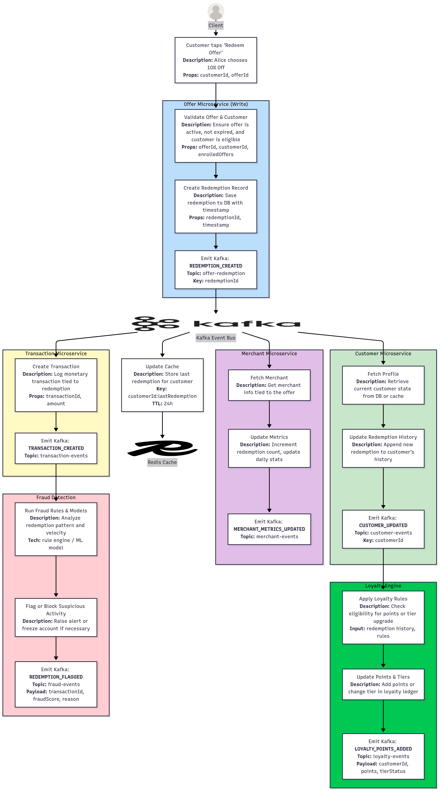

# Credit Card Offers Lifecycle

## Offers Module

## Redemption Module

---
# LEARNING PATH
## Leetcode / Hackerrank Topics
| Day(s) | Topic                            | Problems                                                                               | Real-World Mapping                         |
| ------ | -------------------------------- | -------------------------------------------------------------------------------------- | ------------------------------------------ |
| 1–2    | **Arrays & Hashing (Easy)**      | 1. Two Sum (LC 1)    2. Contains Duplicate (LC 217)                                 | Transaction matching, de-duplication       |
| 3–4    | **Prefix Sum**                   | 1. Subarray Sum Equals K (LC 560)   2. Find Pivot Index (LC 724)                    | Cumulative spend detection, alerting       |
| 5–6    | **Sliding Window (Easy-Medium)** | 1. Longest Substring No Repeat (LC 3)   2. Max Consecutive Ones (LC 485)            | Rate-limiting, de-dup impressions          |
| 7–8    | **Stack (Easy-Medium)**          | 1. Valid Parentheses (LC 20)   2. Daily Temperatures (LC 739)                       | Expression evaluation, trend analysis      |
| 9–10   | **Queue / Monotonic Queue**      | 1. Sliding Window Max (LC 239)   2. Recent Counter (LC 933)                         | Dashboard views, live feed                 |
| 11–13  | **Heap / Priority Queue**        | 1. Kth Largest (LC 215)   2. Top K Frequent (LC 347)   3. Median Stream (LC 295) | Leaderboards, fraud priority scoring       |
| 14–16  | **Binary Search**                | 1. Binary Search (LC 704)   2. Search Rotated Array (LC 33)                         | Offer ID lookups, sorted campaign lists    |
| 17–20  | **Two Pointers**                 | 1. Container With Most Water (LC 11)   2. Three Sum (LC 15)                         | Spend pair detection, fraud triangle       |
| 21–23  | **Linked List**                  | 1. Reverse LL (LC 206)   2. Detect Cycle (LC 141)                                   | Referral chains, cyclic graphs             |
| 24–27  | **Intervals**                    | 1. Merge Intervals (LC 56)   2. Non-overlapping Intervals (LC 435)                  | Offer time conflict resolution             |
| 28–30  | **Recursion / Backtracking**     | 1. Subsets (LC 78)   2. Permutations (LC 46)                                        | Offer rule engine paths                    |
| 31–35  | **Trees & Binary Trees**         | 1. Level Order Traversal (LC 102)   2. Invert Tree (LC 226)                         | Campaign category hierarchies              |
| 36–39  | **Tries**                        | 1. Implement Trie (LC 208)   2. Word Search II (LC 212)                             | Autocomplete, eligibility rule storage     |
| 40–42  | **Graph Traversal**              | 1. Clone Graph (LC 133)   2. Number of Connected Components (LC 323)                | Recommendation chains, clustering          |
| 43–45  | **Union-Find (Disjoint Sets)**   | 1. Friend Circles (LC 547)   2. Redundant Connection (LC 684)                       | Eligibility grouping, fallback routing     |
| 46–49  | **Greedy**                       | 1. Jump Game (LC 55)   2. Gas Station (LC 134)                                      | Optimal campaign path, flow tracking       |
| 50–53  | **Dynamic Programming (Easy)**   | 1. House Robber (LC 198)   2. Climbing Stairs (LC 70)                               | Fraud bypass strategy, budget optimization |
| 54–58  | **DP (Medium-Advanced)**         | 1. Coin Change (LC 322)   2. Longest Palindromic Substring (LC 5)                   | Spend grouping, content scanning           |
| 59     | **System Design Review**         | Reflect on how data structures impact API design, latency, caching                     |                                            |
| 60     | **Mock Test Day**                | Solve 2–3 random problems across topics, simulating interview conditions               |                                            |

---

## AI/ML Topics
| Module Name                         | 📘 Algorithms Applied                                                  | 🧠 LLM / AI Stack Used                                       |
|-------------------------------------|------------------------------------------------------------------------|--------------------------------------------------------------|
| **1. Batch Offer Upload**           | ✅ Regex validation   ✅ Trie   ✅ Dedup (HashSet)                 | —                                                            |
| **2. Reporting Engine**             | ✅ Frequency Map   ✅ Max/Min   ✅ Aggregation Chains              | —                                                            |
| **3. Campaign Comparison Tool**     | ✅ Sorting   ✅ Median/Bucket   ✅ Aggregation logic               | Bedrock Claude (text summaries), Mistral (campaign narrative)|
| **4. Smart Offer Creator (LLM)**    | ✅ Regex   ✅ Subset Match (Backtracking)                            | Bedrock Claude (prompt gen), Titan Embeddings                |
| **5. Customer 360 Profile Builder** | ✅ Set Merge   ✅ Join   ✅ Set Intersection                       | SageMaker tabular model, Titan Embeddings                    |
| **6. Redemption Funnel Tracker**    | ✅ BFS   ✅ Conversion Graphs                                        | Bedrock Claude (summarization), Redis Graph                  |
| **7. Offer Forecasting Engine**     | ✅ Sliding Window   ✅ Top-K (Heap)   ✅ Prefix Sum                | SageMaker (XGBoost), Bedrock Claude (LLM insight gen)        |
| **8. Anomaly & Fraud Detector**     | ✅ Union-Find   ✅ Cycle Detection   ✅ Histogram Scan             | AWS Fraud Detector   SageMaker (unsupervised detection)   |
| **9. Campaign Summary Generator**   | ✅ LCS   ✅ Word Clustering                                          | Bedrock Claude + Mistral                                     |
| **10. Semantic Search (RAG)**       | ✅ Cosine Similarity   ✅ KNN   ✅ Embedding Distance              | Titan Embeddings   OpenSearch RAG                         |
| **11. Fraud Monitoring & Flagging** | ✅ Transaction pattern scan   ✅ Count-Min Sketch   ✅ Trie lookups| Rule Engine + SageMaker anomaly detection                    |
| **12. Recommendation Engine**       | ✅ Priority Queue   ✅ Top-K merge   ✅ Preference Matching        | SageMaker ranking model   Redis TTL Cache (12h)           |
| **13. Loyalty Engine**              | ✅ Threshold Triggers   ✅ Points Accumulator                        | Rule-based logic, future plan: SageMaker reinforcement model |

### 🔰 Learning & Execution Order Recommendation
| Level        | Modules to Start With                                      |
|--------------|------------------------------------------------------------|
| 🟢 Beginner   | Batch Offer Upload, Reporting Engine                       |
| 🟡 Intermediate | Campaign Comparison, Customer 360, Redemption Funnel     |
| 🔴 Advanced   | Forecasting, Fraud Detection, Summary Gen, Semantic Search |

