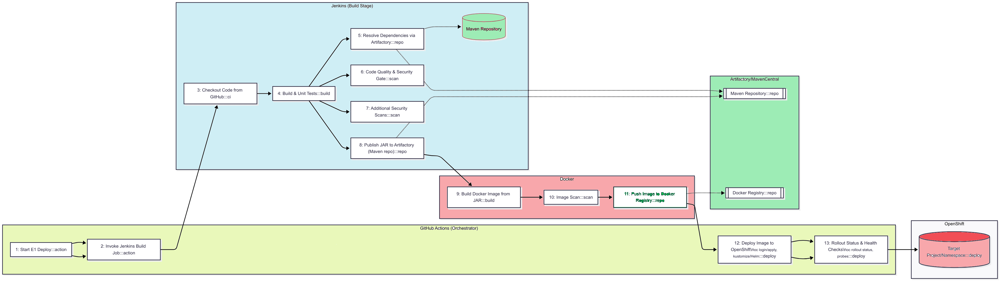
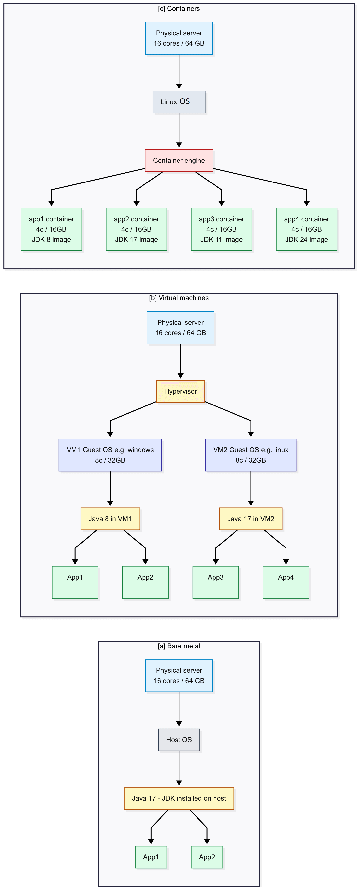

# BUILD

## What is Gradle?
Gradle is a tool that helps you build, test, and package your code. Think of it like a recipe book: it tells your computer how to turn your source code into a finished product (like a jar file).

## Major Sections of Gradle Files
- **plugins**: These are add-ons that give Gradle extra powers. For example, the `org.springframework.boot` plugin helps Gradle build Spring Boot applications.  
  Other useful plugins include:
  - `org.sonarqube`: Integrates SonarQube for code quality analysis.
  - `jacoco`: Adds code coverage reporting.
  - `io.spring.dependency-management`: Manages dependency versions.
  - `application`: Helps run Java applications from the command line.
  ```kotlin
  plugins {
      id("org.springframework.boot") version "3.2.0"
      id("org.sonarqube") version "4.0.0.2929"
      id("jacoco")
      id("java")
  }
  ```

- **java toolchain**: Tells Gradle which version of Java to use.
- **group, version, description**: Basic info about your project.
- **repositories**: Places where Gradle looks for libraries (like Maven Central).<br/><br/>

  <-- DEVELOPMENT -->
- **dependencies**: Lists the libraries your project needs (like Spring Boot, Apache Commons).<br/><br/>

- **tasks**: Special instructions for building, testing, or packaging your code. 
  Specially used for plugins like SonarQube and Jacoco.
  Tasks can be built-in (like `build`, `test`, `clean`) or custom.  
  You can also configure tasks for plugins, such as running SonarQube analysis or generating code coverage reports.
  ```kotlin
  // this sets up the SonarQube task to run after tests complete
  tasks.named("sonarqube") {
      dependsOn("test") // Ensure tests run before analysis
  }
  
  // this configures jacoco to generate code coverage reports
  jacocoTestReport {
      reports {
          xml.required.set(true)
          html.required.set(true)
      }
  }
  ```

### What are Plugins?

Plugins are like apps for Gradle. They add features. For example:
- The **Spring Boot plugin** helps package your app so it can run easily.
- The **Java plugin** helps compile Java code.
- The **Jacoco plugin** generates code coverage reports to see how much of your code is tested.
- The **SonarQube plugin** checks your code for quality issues.
  > NOTE: SonarQube is a tool that analyzes your code for bugs, vulnerabilities, and code smells. It helps you maintain high code quality.
  It is a third party server that is integrated in the CI/CD pipeline to ensure code quality before deployment.
  The server connection is configured in the Jenkins portal by the DevOps team, and developers can run the analysis locally using the SonarQube Gradle plugin. 
  Below is the link about the SonarQube server and its usage:
  
  
<br/>

## Build Lifecycle (How Gradle/Maven Build Projects)

1. **Clean**: Removes old build files.
2. **Compile**: Turns your source code into bytecode <i>(i.e *.java -> *.class)</i>.
3. **Test**: Runs your unit tests.
4. **Package**: Bundles everything into a jar file <i>(jar is a kind of compressed zip file)</i>.
5. **Run/Deploy**: Starts your application.

  Gradle and Maven follow these steps automatically when you run commands like `gradle build` or `mvn package`.
  ```bash
  # Clean and build the project
  ./gradlew clean build
  ```

### How is a Spring Boot Jar Assembled?

- Gradle uses the **bootJar** task to create a special jar file.
- The jar includes your code, libraries, and a manifest file.
- The **main class** (entry point) is set in the Gradle file (`com.example.tutorial.SpringbootStartupApi`).
- When you run the jar, Java looks for this main class and starts your app from there.
  ```kotlin
  tasks.named('bootJar', org.springframework.boot.gradle.tasks.bundling.BootJar) {
    mainClass.set('com.example.tutorial.SpringbootStartupApi')
  }
  ```
  
  This is the typical structure of the spring boot jar file.
  ```plaintext
  example_spring_boot.jar
  ├── META-INF/
  │   └── MANIFEST.MF
  |         # This is the entry point for the application i.e. it launches the jar file.
  |         Main-Class: org.springframework.boot.loader.launch.JarLauncher
  |
  |         # This is the main class of the spring boot application.
  |         Start-Class: com.example.tutorial.SpringbootStartupApi
  |
  |         Spring-Boot-Classes: BOOT-INF/classes/
  |         Spring-Boot-Lib: BOOT-INF/lib/
  ├── org/
  │   └── springframework/
  │       └── boot/
  │           └── loader/ (Spring Boot's loader classes)
  │               └── ... (Actual launcher classes: JarLauncher, WarLauncher, etc.)
  |
  |
  |   ##### MAIN APPLICATION CODE ###
  └── BOOT-INF/
  |   └── classes/ (Your compiled application classes and resources)
  │       └── com/
  │           └── example/
  │               └── tutorial/
  │                   └── SpringbootStartupApi.class
  |                   application.properties
  |                   ...
  └── lib/ (All your application's dependency JARs)
      ├── spring-boot-3.5.0.jar
      ├── spring-core-6.2.7.jar
      ├── commons-lang3-2.19.0.jar
      └── ...
  ```

---
<br/>


# DEPLOYMENT

## What is a Tomcat Server?
Tomcat is a web server that runs Java applications. It listens for HTTP requests and serves responses. Tomcat is often used to run Spring Boot applications, especially when they are packaged as executable jar files.
- In the standard web application mode, tomcat is used to deploy web applications in the form of WAR files only.
The structure  of the tomcat server is as follows:
  ```plaintext
  tomcat/
  ├── bin/ (Scripts to start/stop Tomcat)
  |    # starts the Tomcat server
  |    startup.sh
  |    # stops the Tomcat server
  |    stop.sh
  |    ...
  ├── conf/ (Configuration files)
  ├── lib/ (Libraries used by Tomcat)
  ├── logs/ (Log files)
  ├── webapps/ (Deployed web applications)
  |    # your web applications in WAR format which is again a form of zip compressed file but heavy.
  |    example_webapp1.war
  |    example_webapp2.war
  |    ...
  ├── work/ (Temporary files created by Tomcat)
  └── temp/ (Temporary files used by Tomcat)
  ```
- <b>In the case of Spring Boot, this tomcat server is <u>embedded</u> inside the jar file, so you don't need to install it separately. When you run your Spring Boot application, it starts its own Tomcat server.
  No need to deploy a separate WAR file; just run the jar file, and Tomcat is ready to serve your application.</b>
  ```shell
  # To run your Spring Boot application with embedded Tomcat
  $ java -jar example_spring_boot.jar
  ```

## CICD Complete Process


### Bare Metal Servers VS Virtual Machines (like VMware, VirtualBox) VS Containers (like Docker)

---
