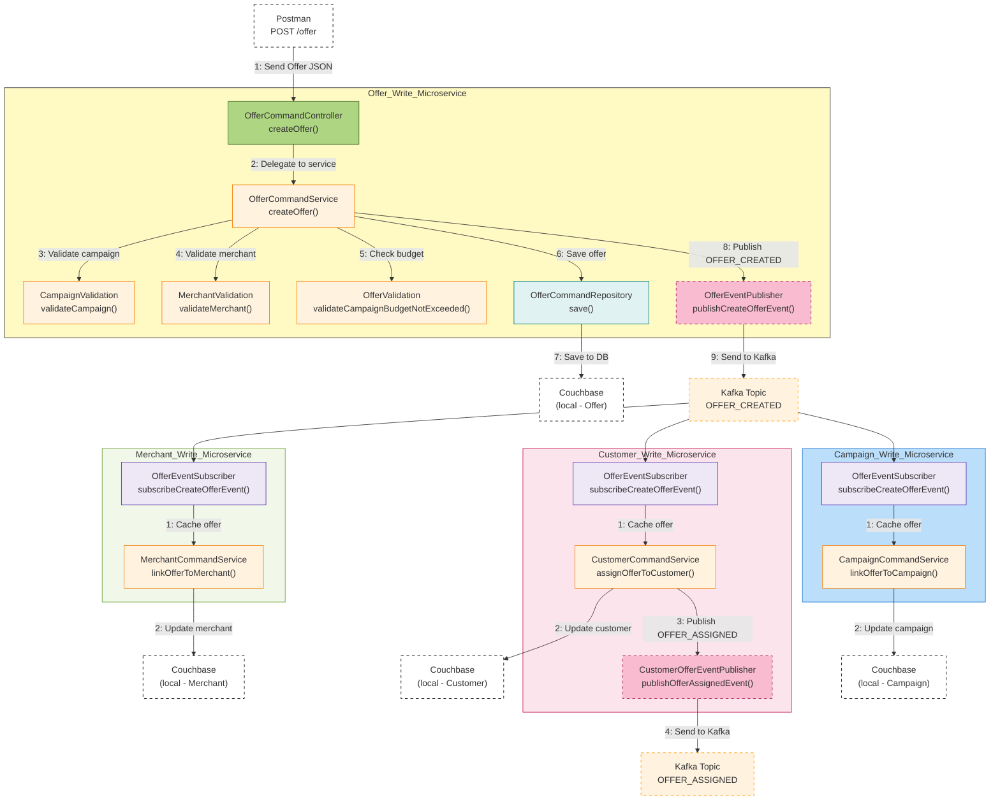

# createOffer
## Flow Diagram

<br/>
<br/>
<br/>

## 🟨 Offer Write Microservice
---
### **1.** `POST /offer` (Triggered by Postman or frontend)
```json
{
  "name": "Electronics Summer Discount",
  "description": "Save $43.30 on select electronics during the Summer Savings Blast campaign.",
  "campaign_id": "campaign::1",
  "merchant_id": "merchant::7",
  "type": "DISCOUNT",
  "discount_amount": 43.3,
  "currency": "USD",
  "valid_from": "2025-07-15T00:00:00",
  "valid_to": "2025-08-07T00:00:00",
  "max_redemptions": 328,
  "status": "ACTIVE",
  "segment_criteria": "GOLD"
}
```
---

### **2.** `OfferCommandController.createOffer()`
- Receives and validates the request body
- Validates required fields
---

### **3.** `CampaignValidation.validateCampaign(campaignId)`
- Fetch Campaign from Cache or REST API call.
- Verifies that campaign:
  - Exists
  - Has status `ACTIVE` <br/>
    (Fails if above conditions are not met ❌)
  
```json
GET /campaigns/campaign::123 → 200 OK
{
  "id": "campaign::123",
  "status": "ACTIVE",
  ...
}
```
---

### **4.** `MerchantValidation.validateMerchant(merchantId)`
- Fetch Merchant from Cache or REST API call.
- Validates that merchant:
  - Exists <br/>
  (Fails if above condition are not met ❌)
  
```json
GET /merchants/merchant::456 → 200 OK
{
  "id": "merchant::456",
  ...
}
```
---

### **5.** `OfferValidation.validateCampaignBudgetNotExceeded(campaignId, offerDiscountAmount)`
- Calls Offer's REST API to fetch all existing offers for that campaign
  - Calculates the total of all `discountAmount`.
  - Adds this to the new offer’s discount to arrive at the total ***totalDiscountAmount***.
- Fetch Campaign from Cache or REST API call.
  - Get's the ***budget*** of that campaign.
- Finally, checks if ***totalDiscountAmount*** exceeds the ***budget*** of the campaign.
  - If it does, the offer is rejected ❌.
  - If not, the offer proceeds to be saved.

```json
Current Offers:
[
  { "id": "offer::1", "discountAmount": 400 },
  { "id": "offer::2", "discountAmount": 500 }
]
New Offer: 300
totalDiscountAmount => (400 + 500) + 300 = 1200

Campaign budget => 1000

RESULT: ❌ REJECTED
  totalDiscountAmount (1200) > budget (1000) 

```
---

### **6.** `OfferCommandRepository.save()`
- Persists the offer in Couchbase
---

### **7.** Couchbase (local - Offer)
```json
{
  "id": "offer::790",
  "title": "20% Cashback on Shoes",
  ...
}
```
---

### **8.** `OfferEventPublisher.publishCreateOfferEvent()`
- Publishes `OFFER_CREATED` event to Kafka
---

### **9.** Kafka Topic: `OFFER_CREATED`
- Triggers subscribers in 3 microservices
---
<br/>


## 🟩 Merchant Write Microservice

#### **MES** – Kafka triggers `subscribeCreateOfferEvent()`

---

#### **1.** Redis Cache
- Writes offer to Redis using `offerId`

---

#### **2.** `MerchantCommandService.linkOfferToMerchant()`

> Adds offer ID to merchant record if not already present.

```json
{
  "id": "merchant::456",
  "linkedOfferIds": ["offer::789", "offer::790"]
}
```

---

#### **3.** Couchbase (local - Merchant)

---

## 🟪 Customer Write Microservice

#### **CES** – Kafka triggers `subscribeCreateOfferEvent()`

---

#### **1.** Redis Cache

---

#### **2.** `CustomerCommandService.assignOfferToCustomer()`

> **Javadoc**:
> ```java
> /**
>  * Assigns offer to all eligible customers.
>  * Uses eligibility engine, updates DB, and publishes event.
>  */
> ```

```json
{
  "id": "customer::123",
  "enrolledOfferIds": ["offer::790"]
}
```

---

#### **3.** Couchbase (local - Customer)

---

#### **4.** `CustomerOfferEventPublisher.publishOfferAssignedEvent()`

---

#### **5.** Kafka Topic: `OFFER_ASSIGNED`

---

## 🟦 Campaign Write Microservice

#### **CAS** – Kafka triggers `subscribeCreateOfferEvent()`

---

#### **1.** Redis Cache

---

#### **2.** `CampaignCommandService.linkOfferToCampaign()`

> Adds the offer to campaign’s `offerIds` list if not already present.

```json
{
  "id": "campaign::123",
  "offerIds": ["offer::789", "offer::790"]
}
```

---

#### **3.** Couchbase (local - Campaign)

---

## 🧠 Design Highlights

- Redis is used for caching only; no fallback logic in this write flow
- `OFFER_ASSIGNED` event is part of event chaining in Customer microservice
- Each microservice writes to its own local Couchbase bucket
- Kafka topics decouple services and improve scalability

---

## 📂 Microservices Involved

- `OfferCommandController`, `OfferCommandService`
- `MerchantCommandService`, `CustomerCommandService`, `CampaignCommandService`
- Kafka Event Publishers and Subscribers
