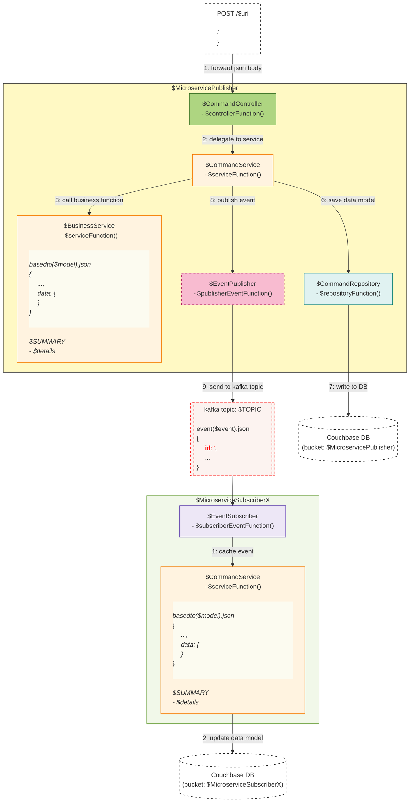

# Spring Boot REST API Microservice Tutorial

This project demonstrates how to build a REST API microservice from scratch using Spring Boot. The API manages campaigns and follows a layered architecture with clear separation of concerns.

## Steps to Create the REST API

1. **Initialize the Spring Boot Project**
   - Use [Spring Initializr](https://start.spring.io/) or your IDE to create a new Spring Boot project.
   - Add dependencies for `spring-boot-starter-web` and any utilities (e.g., Apache Commons).

2. **Define the Data Model**
   - Create DTO classes (e.g., `Campaign`) to represent your domain objects.

3. **Implement the Service Layer**
   - Write service classes for business logic (e.g., `CampaignCommandService`, `CampaignQueryService`).

4. **Create Controller Classes**
   - Implement REST controllers for handling HTTP requests (e.g., `CampaignCommandController`, `CampaignQueryController`).

5. **Configure Persistence (Mock or Real DB)**
   - For demonstration, use mock data utilities. For production, integrate with a database (e.g., Couchbase).

6. **Test the API**
   - Use tools like Postman or curl to test endpoints for creating, updating, retrieving, and deleting campaigns.

7. **(Optional) Add Event Publishing and Kafka Integration**
   - Extend the architecture to publish events and handle asynchronous flows.

## Architecture & Flow

Below is a mermaid diagram illustrating the microservice flow for both publisher and subscriber patterns:

## Example Endpoints

- `POST /api/campaigns` — Create a campaign
- `GET /api/campaigns` — List all campaigns
- `GET /api/campaigns/{id}` — Get campaign by ID
- `PUT /api/campaigns/{id}` — Update campaign
- `DELETE /api/campaigns/{id}` — Delete campaign

## How to Run

1. Build the project:  
   `./gradlew build`
2. Start the application:  
   `./gradlew bootRun`
3. Test endpoints using Postman or curl.

## Next Steps

- Integrate with a real database (e.g., Couchbase, PostgreSQL).
- Add event publishing and Kafka integration for distributed microservices.
- Implement authentication and authorization.

