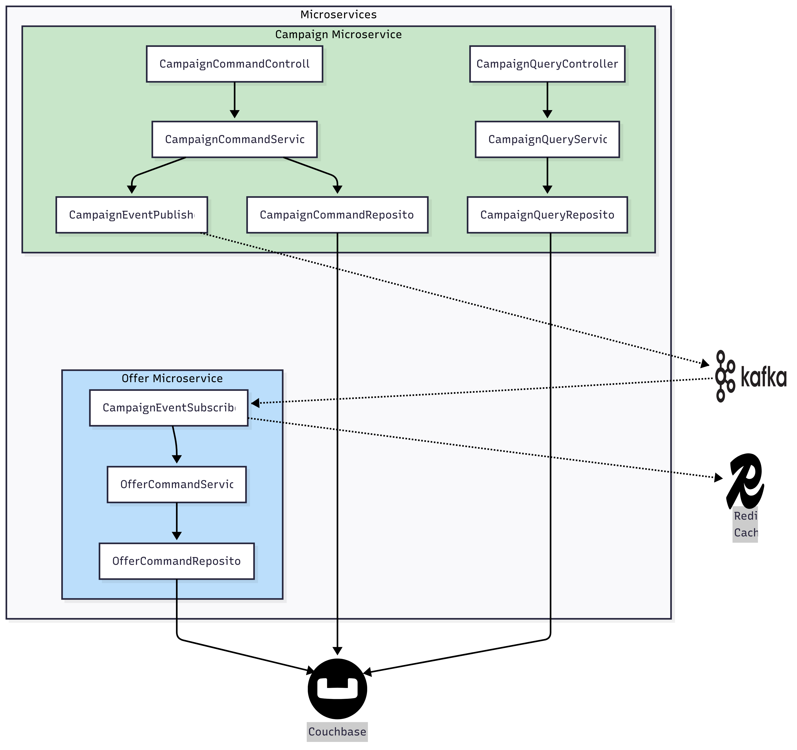
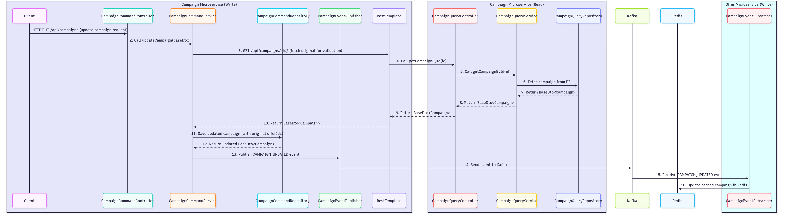
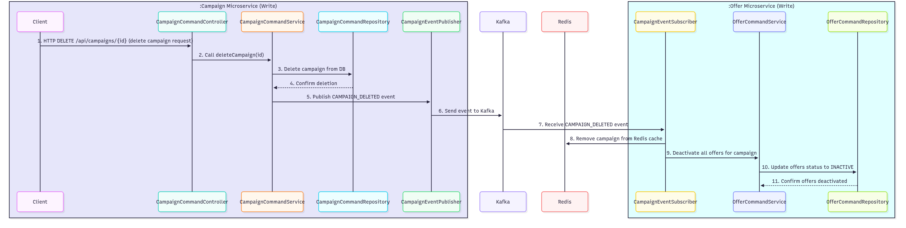

# Event-Driven Architecture: Campaign Creation & Deletion Flow

### Architecture Diagram

## Flow: `createCampaign` / `updateCampaign`
### 1. Campaign Microservice (Write)

- **API Request**
  - Client sends a POST / PUT request to `/api/campaigns` with campaign details.
- **CampaignCommandController**
  - Receives the request and calls `CampaignCommandService.createCampaign()` / `CampaignCommandService.updateCampaign()`.
- **CampaignCommandService**
    - **createCampaign**
      - Generates a unique campaign ID.
      - Wraps the campaign data in a `BaseDto`.
      - Saves the campaign to the database.
      - Publishes a `CAMPAIGN_CREATED` event using `CampaignEventPublisher`.
    - **updateCampaign**
      - Validates that the offer lists are not overridden by the update.  
        Instead, it calls the REST API of the Campaign to fetch the existing campaign for the given ID 
        and then overrides the existing offers with the new ones.
      - Publishes a `CAMPAIGN_UPDATED` event using `CampaignEventPublisher`.
- **CampaignEventPublisher**
  - Constructs a `CampaignEvent` object.
  - Publishes the event to the Kafka topic `CAMPAIGN_CREATED` / `CAMPAIGN_UPDATED`.

---

### 2. Kafka Queue

- **Kafka Event Bus**
  - The `CAMPAIGN_CREATED` / `CAMPAIGN_UPDATED` event is broadcast to all subscribers.

---

### 3. Offer Microservice (Write)

- **CampaignEventSubscriber**
  - Listens to the `CAMPAIGN_CREATED` / `CAMPAIGN_UPDATED` Kafka topic.
  - Caches the campaign details in Redis Cache for fast access.

---

### 4. Redis Cache

- **Redis Cache**
  - Stores the campaign details received from the event for quick retrieval by the Offer microservice.

---

### Sequence Diagram :: updateCampaign

## Flow: `deleteCampaign`

### 1. Campaign Microservice (Write)

- **API Request**
  - Client sends a DELETE request to `/api/campaigns/{id}`.
- **CampaignCommandController**
  - Receives the request and calls `CampaignCommandService.deleteCampaign(id)`.
- **CampaignCommandService**
  - Deletes the campaign from the database.
  - Publishes a `CAMPAIGN_DELETED` event using `CampaignEventPublisher`.
- **CampaignEventPublisher**
  - Constructs a `CampaignEvent` object.
  - Publishes the event to the Kafka topic `CAMPAIGN_DELETED`.

---

### 2. Kafka Queue

- **Kafka Event Bus**
  - The `CAMPAIGN_DELETED` event is broadcast to all subscribers via the `CAMPAIGN_DELETED` topic.

---

### 3. Offer Microservice (Write)

- **CampaignEventSubscriber**
  - Listens to the `CAMPAIGN_DELETED` Kafka topic.
  - Removes the campaign from Redis Cache.
  - Deactivates all offers associated with the campaign.

---

### 4. Redis Cache

- **Redis Cache**
  - Removes the campaign details when a campaign is deleted.

---

### Architecture Diagram : deleteCampaign

---

## Summary

- The `createCampaign` / `updateCampaign` and `deleteCampaign` flows are separated by microservice responsibility, Kafka queue, and Redis Cache.
- Campaign creation is persisted, broadcast via Kafka, and cached for fast access by the Offer microservice.
- Campaign deletion removes the campaign from the database, broadcasts the event, removes it from Redis Cache, and deactivates associated offers.
