# Event-Driven Architecture: Campaign Creation & Deletion Flow

## Flow: `createCampaign` (Grouped by Microservices, Kafka Queue, and Redis Cache)

### 1. Campaign Microservice (Write)

- **API Request**
  - Client sends a POST request to `/api/campaigns` with campaign details.
- **CampaignCommandController**
  - Receives the request and calls `CampaignCommandService.createCampaign()`.
- **CampaignCommandService**
  - Generates a unique campaign ID.
  - Wraps the campaign data in a `BaseDto`.
  - Saves the campaign to the database.
  - Publishes a `CAMPAIGN_CREATED` event using `CampaignEventPublisher`.
- **CampaignEventPublisher**
  - Constructs a `CampaignEvent` object.
  - Publishes the event to the Kafka topic `CAMPAIGN_CREATED`.

---

### 2. Kafka Queue

- **Kafka Event Bus**
  - The `CAMPAIGN_CREATED` event is broadcast to all subscribers via the `CAMPAIGN_CREATED` topic.

---

### 3. Offer Microservice (Write)

- **CampaignEventSubscriber**
  - Listens to the `CAMPAIGN_CREATED` Kafka topic.
  - Caches the campaign details in Redis Cache for fast access.

---

### 4. Redis Cache

- **Redis Cache**
  - Stores the campaign details received from the event for quick retrieval by the Offer microservice.

---

### Architecture Diagram

---

## Flow: `deleteCampaign` (Grouped by Microservices, Kafka Queue, and Redis Cache)

### 1. Campaign Microservice (Write)

- **API Request**
  - Client sends a DELETE request to `/api/campaigns/{id}`.
- **CampaignCommandController**
  - Receives the request and calls `CampaignCommandService.deleteCampaign(id)`.
- **CampaignCommandService**
  - Deletes the campaign from the database.
  - Publishes a `CAMPAIGN_DELETED` event using `CampaignEventPublisher`.
- **CampaignEventPublisher**
  - Constructs a `CampaignEvent` object.
  - Publishes the event to the Kafka topic `CAMPAIGN_DELETED`.

---

### 2. Kafka Queue

- **Kafka Event Bus**
  - The `CAMPAIGN_DELETED` event is broadcast to all subscribers via the `CAMPAIGN_DELETED` topic.

---

### 3. Offer Microservice (Write)

- **CampaignEventSubscriber**
  - Listens to the `CAMPAIGN_DELETED` Kafka topic.
  - Removes the campaign from Redis Cache.
  - Deactivates all offers associated with the campaign.

---

### 4. Redis Cache

- **Redis Cache**
  - Removes the campaign details when a campaign is deleted.

---

### Architecture Diagram

---

## Summary

- The `createCampaign` and `deleteCampaign` flows are separated by microservice responsibility, Kafka queue, and Redis Cache.
- Campaign creation is persisted, broadcast via Kafka, and cached for fast access by the Offer microservice.
- Campaign deletion removes the campaign from the database, broadcasts the event, removes it from Redis Cache, and deactivates associated offers.
